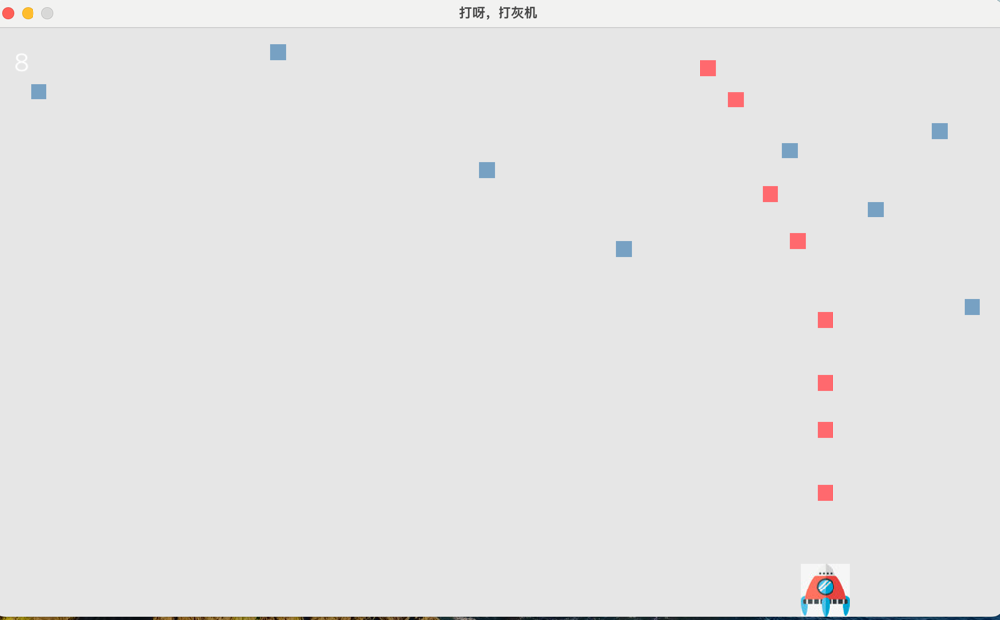
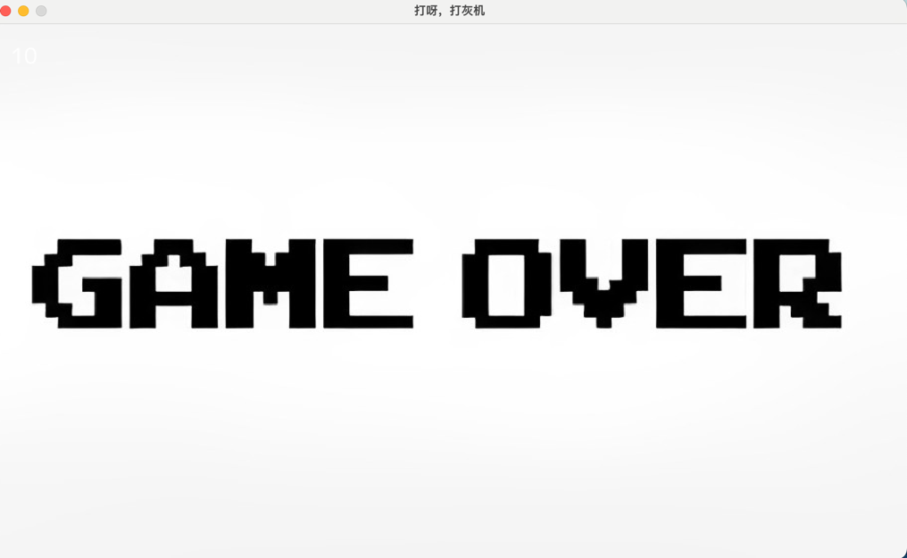
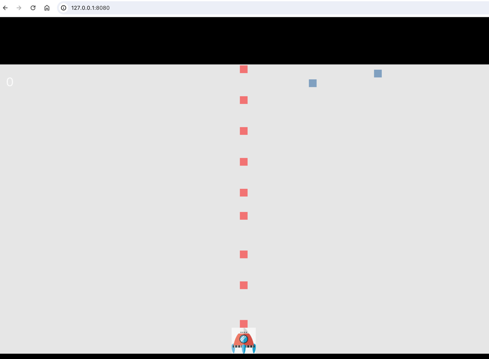

# 使用ebiten实现打灰机的游戏

实现的功能
1. 自动和手动发射子弹
2. 调节子弹和炮弹的发射速度
3. 实时显示分数
4. 播放背景音乐
5. 使用网站展示游戏

## 启动游戏
```shell
go run main.go
```

## 效果




### 参考地址
[框架包](https://github.com/hajimehoshi/ebiten)
[游戏启发地址【https://zhuanlan.zhihu.com/p/589794581】](https://zhuanlan.zhihu.com/p/589794581)
[网页预览【https://zhuanlan.zhihu.com/p/680470987】](https://zhuanlan.zhihu.com/p/680470987)
